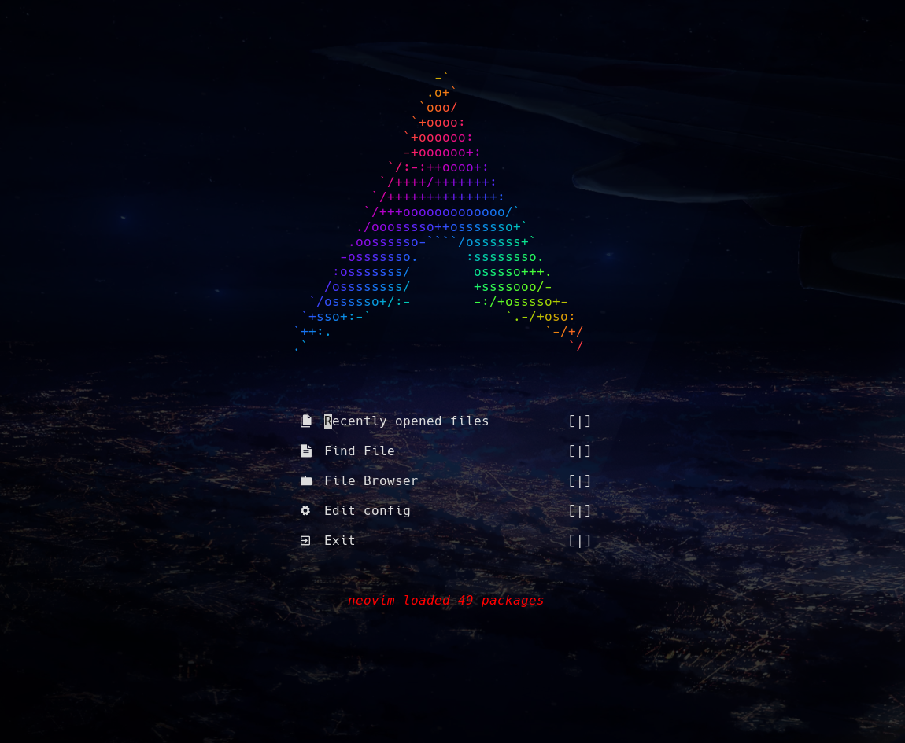

# neovim配置简述

依赖在`../install.sh`的必装部分，此目录下`./install.sh`会安装主要的依赖项。

插件配置在`nvim/lua/plugins`目录下，使用[ lazy ](https://github.com/folke/lazy.nvim)插件管理器安装。

- `./coc-config``coc-settings.json`:[ coc ](https://github.com/neoclide/coc.nvim)未使用，但保留其配置。
- `./colors`:配置neovim透明,用`colorscheme`使用，例如在配置[ tokyonight ](https://github.com/folke/tokyonight.nvim)后加载,使得背景透明。
- `./dashboard`:是[ dashboard.nvim ](https://github.com/glepnir/dashboard-nvim)的`preview file`。
- `./ftplugin`:neovim会根据文件类型加载其中文件,`文件类型`+`.lua/vim`后缀。
- `./lua/dap-conf`:是对各个语言`Debug Adapter`的配置。
- `./lua/plugins`:是对各个插件的配置。
- `./lua/lsp`:是对各个`lsp`的`setting`部分的配置,返回一个`setting`部分的`table`,nvim-lspconfig会加载其中`.lua`后缀的文件。
- `./plugin`:nvim会自动加载其中`.vim/lua`文件。
- `./vim-config`:对vim相关的配置。
- `./viml`:vim和neovim的共用配置。
- `./cheatsheets.txt`:[ vim操作速查 ](https://github.com/skywind3000/awesome-cheatsheets/blob/master/editors/vim.txt)。
- `./tasks.ini`:插件[ asynctasks ](https://github.com/skywind3000/asynctasks.vim)的配置

        └─$ tree -d           
        .
        ├── coc-config
        ├── colors
        ├── dashboard
        │   ├── footers
        │   ├── pictures
        │   └── the_cat
        ├── ftplugin
        ├── lua
        │   ├── dap-conf
        │   ├── lsp
        │   └── plugins
        ├── pictures
        ├── plugin
        ├── spell
        ├── vim-config
        │   └── vim-lsp
        └── viml
            └── template
## 推荐几个教程
- [ Vim 从入门到精通 ](https://github.com/wsdjeg/vim-galore-zh_cn)
- [ 在neovim中使用lua ](https://github.com/glepnir/nvim-lua-guide-zh)
- [ 中文速查表 ](https://github.com/skywind3000/awesome-cheatsheets)
- [ 菜鸟教程 ](https://www.runoob.com/lua/lua-tutorial.html)

# License
[MIT](./LICENSE)
